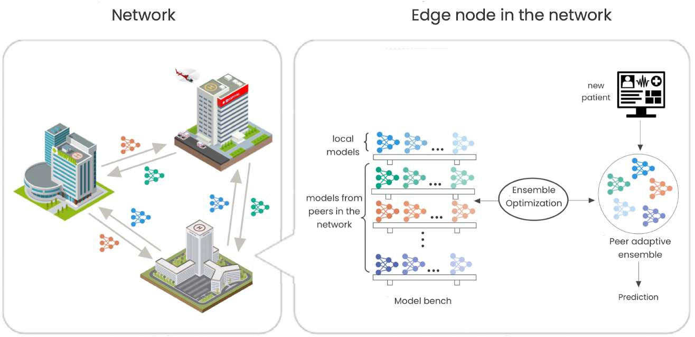

# FedPAE: Peer-Adaptive Ensemble Learning for Asynchronous and Model-Heterogeneous Federated Learning

Decentralized, model-heterogeneous personalized federated learning via peer-to-peer model exchange and ensemble selection.

Published in [2024 IEEE International Conference on Big Data (BigData)](https://ieeexplore.ieee.org/abstract/document/10825304).

<p align="center">
  
</p>

---

## Overview

FedPAE is a personalized federated learning (pFL) algorithm designed to address restrictive assumptions commonly imposed by existing federated learning approaches. Specifically, it removes the need for shared model architectures, centralized coordination, and synchronized communication. Instead of relying on a central server for model aggregation, clients communicate with each other directly through a peer-to-peer model exchange. Each client maintains a "model bench," a collection of its own models alongside those received from peers. From this bench, NSGA-II is used to select a subset of classifiers by jointly optimizing for ensemble strength and [diversity](https://proceedings.mlr.press/v97/pang19a/pang19a.pdf). Because ensemble selection is performed independently using local validation data, FedPAE enables each client to leverage the most relevant peer models while excluding those that hurt local performance.

The implementation is built on top of the [HtFLlib](https://github.com/TsingZ0/HtFLlib) federated learning infrastructure.

---

## Pipeline

FedPAE runs in two phases:

**Phase 1 — Base Classifier Training + Model Exchange**
Clients independently train heterogeneous base classifiers on their local data, then exchange models with peers, resulting in each client holding a collection of local and externally trained classifiers.

**Phase 2 — NSGA-II Ensemble Selection**
Each client runs NSGA-II to select a subset of classifiers that maximize:
- *Strength*: average validation accuracy of individual classifiers
- *Diversity*: independence of predicted probabilities between classifier pairs ([Pang et al.](https://proceedings.mlr.press/v97/pang19a/pang19a.pdf) measure)

From the resulting Pareto front, the ensemble with the highest overall accuracy on the validation set is selected.

---

## Requirements

```
torch >= 2.0
scikit-learn
numpy
deap
```

---

## Data

Each dataset lives under `dataset/<name>/train/` and `dataset/<name>/test/`, with one `.npz` file per client.

MNIST with 20 non-IID clients (Dirichlet alpha=0.1) is included for quick testing. For CIFAR-10, use the dataset generation scripts from [HtFLlib](https://github.com/TsingZ0/HtFLlib).

---

## Usage

```bash
cd system
python main.py \
  -data mnist -m HtFE-img-2-gray -ncl 10 \
  -nc 20 -gr 1 -ls 5 -lbs 32 \
  --partition-type dir --partition-alpha 0.1 \
  --ckpt_root ../ckpts --outputs_root ../outputs \
  --device cpu
```

### Key Arguments

**Phase 1 — Base Classifiers**

| Argument | Default | Description |
|---|---|---|
| `--base_split_mode` | `split_train` | `oof_stacking` uses cross-validation to generate out-of-fold predictions |
| `--base_clf_lr` | `5e-4` | Base classifier learning rate |
| `--base_es_patience` | `20` | Early stopping patience |

**Phase 2 — NSGA-II Ensemble Selection**

| Argument | Default | Description |
|---|---|---|
| `--pae_pop_size` | `40` | NSGA-II population size |
| `--pae_num_generations` | `40` | Number of NSGA-II generations |
| `--pae_diversity_measure` | `pang` | Diversity objective: `pang` (DPP-based), `cosine` (1 - cosine similarity), `double_fault` (1 - P(both wrong)) |
| `--pae_ensemble_size` | `None` | Fixed ensemble size (overrides min/max) |
| `--pae_ensemble_sizes` | `""` | Comma-separated sizes to sweep (e.g. `"2,3,4"`) |
| `--pae_combination_mode` | `soft` | `soft` = average probabilities, `hard` = majority vote |
| `--pae_eval_metric` | `acc` | Metric for selecting best ensemble: `acc` or `bacc` |
| `--pae_mutation_prob` | `0.05` | Per-individual mutation probability |
| `--pae_crossover_prob` | `0.9` | Crossover probability |
| `--pae_prune_bottom_pct` | `0` | Remove bottom X% of classifiers before selection (0 = off) |

### Model Families

| Family | Models | Input |
|---|---|---|
| `HtFE-img-2-gray` | 2x FedAvgCNN | Grayscale (e.g. MNIST) |
| `HtFE-img-2` | FedAvgCNN + ResNet-18 | RGB |
| `HtFE-img-4` | FedAvgCNN + ResNet-34 + MobileNetV2 + ResNet-18 | RGB |
| `HtFE-img-5` | GoogLeNet + MobileNetV2 + ResNet-18/34/50 | RGB |
| `HtFE-img-8` | FedAvgCNN + GoogLeNet + MobileNetV2 + ResNet-18/34/50/101/152 | RGB |

---

## Citation

```bibtex
@inproceedings{mueller2024fedpae,
  title={FedPAE: Peer-Adaptive Ensemble Learning for Asynchronous and Model-Heterogeneous Federated Learning},
  author={Mueller, Brianna and Street, W. Nick and Baek, Stephen and Lin, Qihang and Yang, Jian and Huang, Yanbo},
  booktitle={2024 IEEE International Conference on Big Data (BigData)},
  pages={7961--7970},
  year={2024},
  organization={IEEE}
}
```
